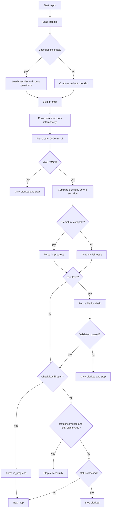
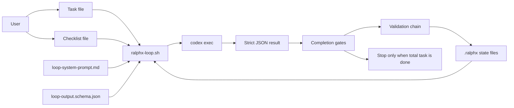

# Architecture

This document explains the runtime flow of `ralphx` with a process diagram and a component chain diagram.

## Process Flow

## Component Chain

## Why both diagrams matter

- The process flow explains control logic.
- The component chain explains what files and tools participate in the loop.
- Together they make the method easier to adopt in another repository.
