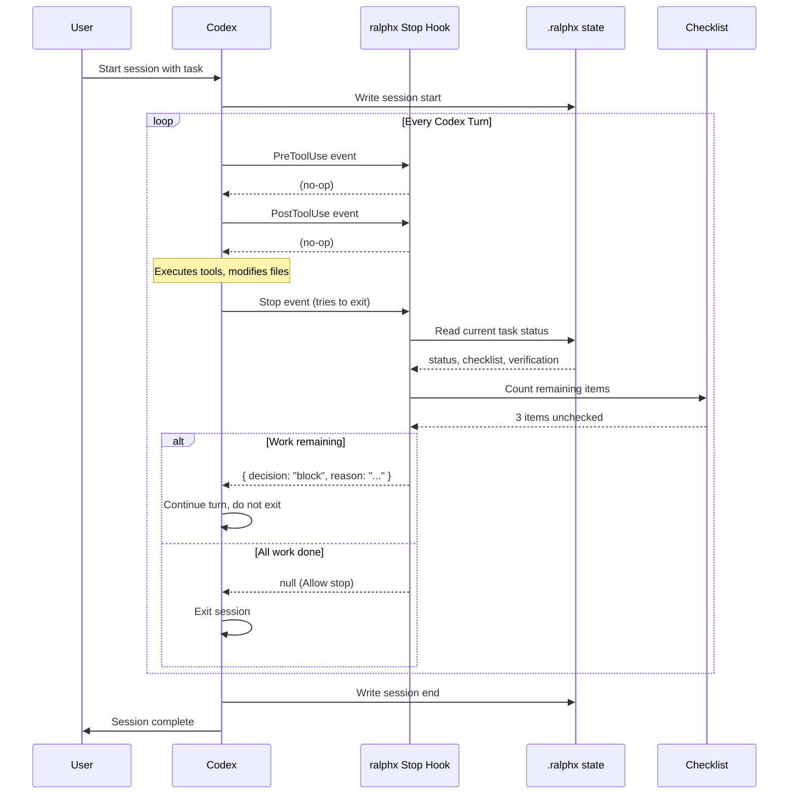

# Codex Self-Loop Mechanism

This document explains how `ralphx` achieves persistent agent execution through a **Stop-hook interception pattern**, inspired by the oh-my-codex architecture.

## Core Concept

**The agent loop is not a `while(true)` in the harness.** Instead, Codex itself runs turn by turn, and the harness intercepts every **Stop decision** from Codex. If work remains incomplete, the harness returns `decision: block` — Codex receives this and continues, rather than exiting.

This is an **event-driven continuation loop**, not a polling loop:

```
Codex executes a turn
        ↓
Codex decides to stop → triggers Stop Hook
        ↓
Hook checks: is work still active?
        ├─ Yes → return { decision: "block", reason: "continue task..." }
        │       → Codex continues the current turn
        └─ No  → return null
                  → Codex exits normally
```

This means the "loop" is implicit in Codex's turn structure. The harness only intercepts, it does not drive.

---

## Why Stop Hook?

Codex (and OpenAI's agent protocol) exposes a set of lifecycle hook events:

| Event | When it fires | Harness use |
|---|---|---|
| `SessionStart` | New session begins | Initialize state, inject context |
| `UserPromptSubmit` | User submits a prompt | Detect workflow keywords, inject routing |
| `PreToolUse` | Before a tool runs | Safety checks, state tracking |
| `PostToolUse` | After a tool runs | Transport failure detection |
| `Stop` | Codex tries to end the session | **The loop control point** |

The `Stop` hook is the critical one. Codex calls `Stop` when it believes the task is complete. The harness can override this by returning a **block decision**, which tells Codex "do not stop, keep working."

---

## Stop Guard Priority Chain

When Codex fires the `Stop` event, `ralphx` evaluates guards in this order:

```
1. isStopExempt()
   cancel / abort / context-limit / compact → Allow (exit immediately)

2. hasActiveTask()
   task active but not complete → Block ("continue the current task")

3. hasPendingChecklistItems()
   checklist has unchecked items → Block ("checklist items remain")

4. isVerificationRequired()
   no verification result yet → Block ("verification evidence required")

5. All guards pass → Allow (Codex exits normally)
```

### Block Response Shape

```json
{
  "decision": "block",
  "reason": "task still in_progress, checklist has 3 remaining items",
  "stopReason": "task_incomplete",
  "systemMessage": "ralphx is still active; continue the task and gather fresh verification evidence before stopping."
}
```

Codex receives this response. If `decision == "block"`, it does not exit — it continues the current execution turn.

---

## Full Lifecycle Loop Diagram



---

## Comparison: Self-Loop vs Polling Loop

| Aspect | Polling Loop (naive) | Stop Hook (ralphx/oh-my-codex) |
|---|---|---|
| Driver | Harness drives by clock | Codex drives by intent |
| Check frequency | Fixed interval (e.g. every 5s) | On every Stop attempt |
| State freshness | Stale between polls | Real-time |
| CPU cost | Continuous | Near-zero when idle |
| Integration complexity | Low | Requires Codex hook support |
| Works for Codex | No native hook API | Native via `hooks.json` |

The Stop Hook pattern is the correct architecture when the execution engine (Codex) exposes lifecycle hooks. A polling loop is only appropriate when you control the agent loop itself.

---

## Hook Event Types and Their Roles

### SessionStart

```typescript
// Fires when Codex begins a new session
// Use: Initialize .ralphx state, inject persistent context
```

### UserPromptSubmit

```typescript
// Fires when user submits a prompt
// Use: Detect workflow activation keywords, inject routing hints
// Example: prompt contains "$ralphx" → activate ralphx workflow
```

### PreToolUse / PostToolUse

```typescript
// Fires before/after each tool execution
// Use: Track state changes, detect MCP transport failures
```

### Stop ← **Loop Controller**

```typescript
// Fires when Codex tries to exit
// Use: Intercept and block if work remains
// Decision returned here controls whether the session continues
```

---

## Ralphx Stop Guard States

The stop guard evaluates `.ralphx/state.json` for these fields:

```json
{
  "active": true,
  "mode": "ralphx",
  "task": "tasks/demo.md",
  "checklist": "tasks/demo.checklist.md",
  "status": "in_progress",
  "completed_items": 5,
  "total_items": 8,
  "verification_passed": false
}
```

Guard logic:

- `active == false` → Allow stop
- `status == "complete"` and `verification_passed == true` and no pending items → Allow stop
- Otherwise → Block

---

## Implementing in a New Agent Runtime

If you are building a harness for a different agent (not Codex), implement the same pattern:

```go
// Pseudocode for a Stop-hook-compatible agent harness
func (h *Harness) OnStop(ctx context.Context, req StopRequest) StopResponse {
    state := h.ReadState()

    // Exemptions: user-initiated cancel, context limit, etc.
    if req.Reason == "cancel" || req.Reason == "context_limit" {
        return StopResponse{Allow: true}
    }

    // Block if task is incomplete
    if state.Status == "in_progress" {
        return StopResponse{
            Allow:  false,
            Block:  true,
            Reason: "task still in_progress, continue working",
            System: "Harness is still active; keep working until the task is done.",
        }
    }

    // Block if checklist has remaining items
    remaining := h.CountRemainingChecklistItems(state.ChecklistPath)
    if remaining > 0 {
        return StopResponse{
            Allow:  false,
            Block:  true,
            Reason: fmt.Sprintf("%d checklist items remain", remaining),
            System: "Checklist items remain; complete all items before stopping.",
        }
    }

    // All guards pass
    return StopResponse{Allow: true}
}
```

The key insight: **the harness does not loop — it intercepts the agent's own exit decision and overrides it when conditions are not met.**

---

## Files Involved

| File | Role |
|---|---|
| `internal/hooks/stop_guard.go` | Stop guard evaluator |
| `internal/hooks/native.go` | Native hook dispatcher |
| `internal/hooks/event_types.go` | Hook event type definitions |
| `internal/state/state.go` | `.ralphx/state.json` read/write |
| `cmd/hook.go` | CLI entrypoint for `ralphx hook native` |
| `prompts/loop-system-prompt.md` | Codex prompt with workflow context |
| `~/.codex/hooks.json` | Native hook registration |

---

## Reference: oh-my-codex Architecture

This pattern was reverse-engineered from [oh-my-codex](https://github.com/nicknochnack/oh-my-codex), specifically its `codex-native-hook.ts` implementation. The key differences:

| Aspect | oh-my-codex | ralphx |
|---|---|---|
| Language | TypeScript | Go |
| Target | Codex CLI + OpenAI agent protocol | Codex exec |
| Modes | ralph, team, ralplan, ultrawork | ralphx only |
| Team execution | Multi-worker tmux | Single worker |
| Extensibility | Plugin system via `dispatchHookEvent` | Built-in hooks only |
| Notifications | Discord/Telegram/Slack/webhook | None |
