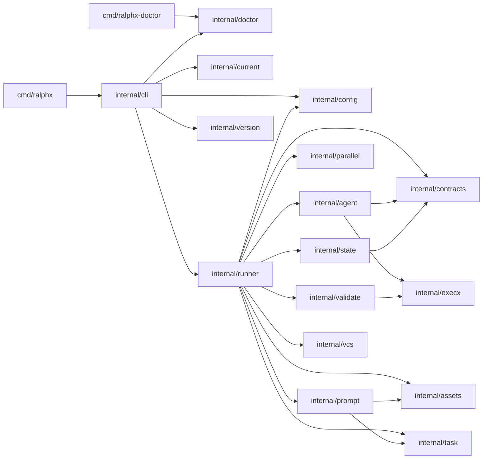
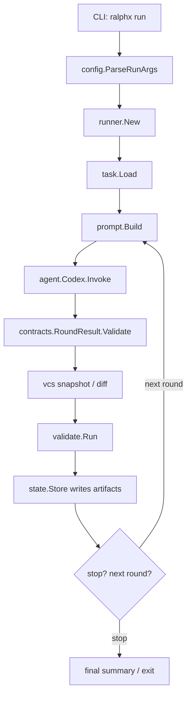
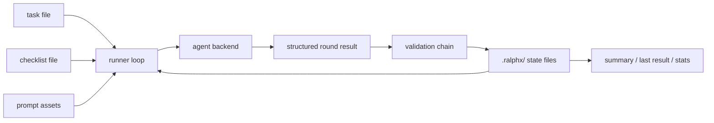
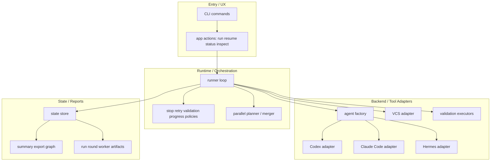
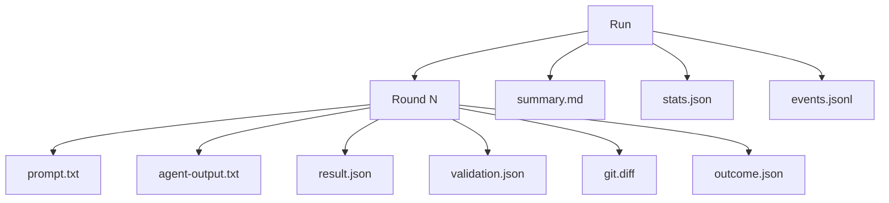
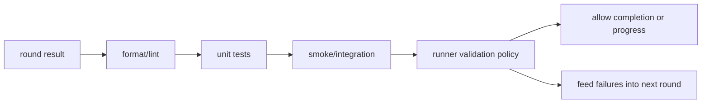
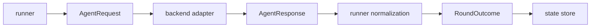
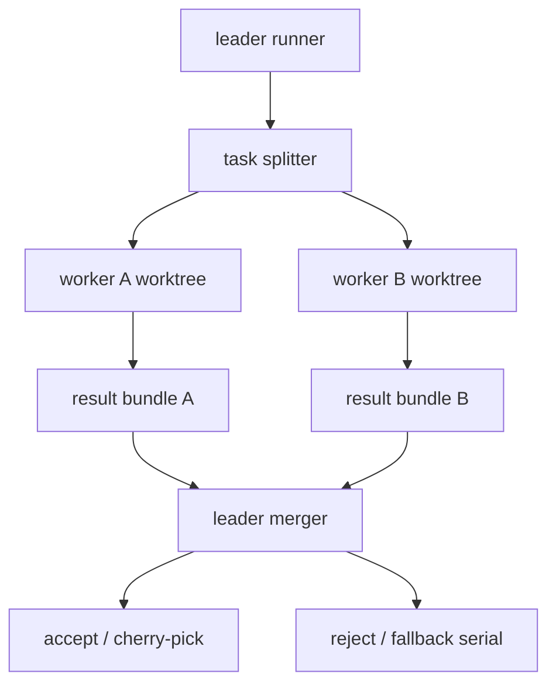

# ralphx Refactor Graph Atlas

This document collects the key graphs needed to analyze and execute the next `ralphx` runtime refactor.

## 1. Current module dependency graph

## 2. Current runtime control path

## 3. Current state and artifact flow

## 4. Refactor target layers

## 5. Proposed run/round state model

## 6. Planned validation pipeline

## 7. Planned backend invocation contract

## 8. Safe parallel execution target

## 9. Recommended doc-to-code mapping

| Concern | Current files | Likely future home |
| --- | --- | --- |
| CLI dispatch | `internal/cli/app.go` | `internal/app/*` + thinner `internal/cli/app.go` |
| Agent backend | `internal/agent/codex.go` | `internal/agent/{factory,codex,claudecode,hermes}.go` |
| Runner loop | `internal/runner/loop.go` | `internal/runner/{loop,policies,stop,progress}.go` |
| Validation | `internal/validate/validate.go` | `internal/validate/{pipeline,steps}.go` |
| State | `internal/state/*` | `internal/state/*` + `internal/report/*` |
| Parallel | `internal/parallel/*` | `internal/parallel/{scheduler,planner,merger}.go` |
| Graph/export | docs only today | `internal/report/graph.go` later |

## 10. How to use this atlas

- Use section 1 before changing package boundaries.
- Use sections 2–3 when validating current behavior preservation.
- Use sections 4–8 when implementing the staged runtime refactor.
- Keep this atlas updated whenever package boundaries or artifact layout change.
