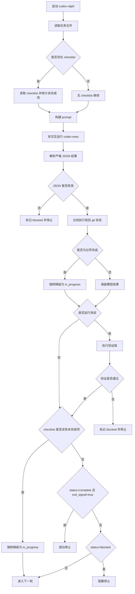
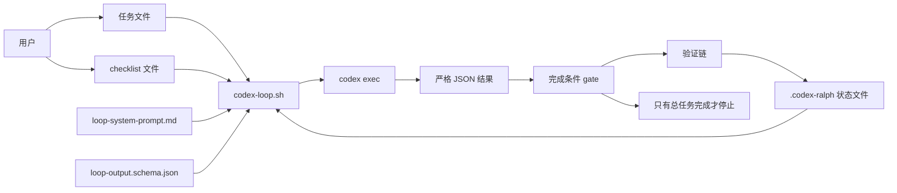

# 架构与链路图

本文说明 `codex-ralph` 的运行流程图和组件链路图。

## 流程图

```mermaid
flowchart TD
    A[启动 codex-ralph] --> B[读取任务文件]
    B --> C{是否存在 checklist}
    C -- 是 --> D[读取 checklist 并统计未完成项]
    C -- 否 --> E[无 checklist 继续]
    D --> F[构建 prompt]
    E --> F
    F --> G[非交互运行 codex exec]
    G --> H[解析严格 JSON 结果]
    H --> I{JSON 是否有效}
    I -- 否 --> J[标记 blocked 并停止]
    I -- 是 --> K[比较执行前后 git 状态]
    K --> L{是否为过早完成}
    L -- 是 --> M[强制降级为 in_progress]
    L -- 否 --> N[保留模型结果]
    M --> O{是否运行测试}
    N --> O
    O -- 是 --> P[执行验证链]
    O -- 否 --> Q{checklist 是否还有未完成项}
    P --> R{验证是否通过}
    R -- 否 --> S[标记 blocked 并停止]
    R -- 是 --> Q
    Q -- 是 --> T[强制降级为 in_progress]
    Q -- 否 --> U{status=complete 且 exit_signal=true}
    T --> V[进入下一轮]
    U -- 是 --> W[成功停止]
    U -- 否 --> X{status=blocked}
    X -- 是 --> Y[阻塞停止]
    X -- 否 --> V
```

## 链路图

```mermaid
flowchart LR
    User[用户] --> Task[任务文件]
    User --> Checklist[checklist 文件]
    Task --> Loop[codex-loop.sh]
    Checklist --> Loop
    Prompt[loop-system-prompt.md] --> Loop
    Schema[loop-output.schema.json] --> Loop
    Loop --> Codex[codex exec]
    Codex --> Json[严格 JSON 结果]
    Json --> Gate[完成条件 gate]
    Gate --> Validate[验证链]
    Validate --> State[.codex-ralph 状态文件]
    State --> Loop
    Gate --> Stop[只有总任务完成才停止]
```

## 为什么要同时有两张图

- 流程图说明控制逻辑
- 链路图说明参与运行的文件和工具
- 两者一起，才能更容易把这套方法迁移到别的仓库
