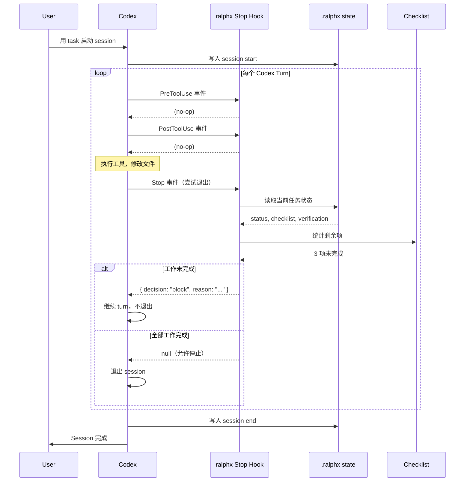

# Codex 自循环机制

本文档解释 `ralphx` 如何通过 **Stop Hook 拦截模式** 实现 agent 持续执行，核心思路来自 oh-my-codex 架构。

## 核心理念

**Agent loop 不是 harness 里的 `while(true)`。** Codex 自己按 turn 执行，harness 拦截每一次来自 Codex 的 **Stop 决策**。如果工作未完成，就返回 `decision: block` — Codex 收到后继续执行，而不是退出。

这是一个**事件驱动的继续循环**，而非轮询循环：

```
Codex 执行一个 turn
        ↓
Codex 尝试停止 → 触发 Stop Hook
        ↓
Hook 检查：工作是否仍然活跃？
        ├─ 是 → return { decision: "block", reason: "继续任务..." }
        │       → Codex 收到 block → 不退出 → 继续下一个 turn
        └─ 否 → return null
                  → Codex 正常退出
```

这意味着"循环"是隐含在 Codex 的 turn 结构中的。harness 只做拦截，不做驱动。

---

## 为什么是 Stop Hook？

Codex（和 OpenAI 的 agent protocol）暴露了一组生命周期 hook 事件：

| 事件 | 触发时机 | Harness 用途 |
|---|---|---|
| `SessionStart` | 新 session 开始 | 初始化状态，注入上下文 |
| `UserPromptSubmit` | 用户提交 prompt | 检测 workflow 关键字，注入路由提示 |
| `PreToolUse` | 工具执行前 | 安全检查，状态跟踪 |
| `PostToolUse` | 工具执行后 | MCP 传输失败检测 |
| `Stop` | Codex 尝试退出时 | **循环控制点** |

`Stop` hook 是关键。Codex 在认为任务完成时会调用 `Stop`。Harness 可以通过返回 **block 决策** 来覆盖这个行为，告诉 Codex"不要停止，继续工作"。

---

## Stop Guard 优先级链路

当 Codex 触发 `Stop` 事件时，`ralphx` 按以下顺序评估守卫：

```
1. isStopExempt()
   cancel / abort / context-limit / compact → Allow（立即退出）

2. hasActiveTask()
   任务活跃但未完成 → Block（"继续当前任务"）

3. hasPendingChecklistItems()
   checklist 有未完成项 → Block（"checklist 项仍然存在"）

4. isVerificationRequired()
   尚无验证结果 → Block（"需要验证证据"）

5. 全部通过 → Allow（Codex 正常退出）
```

### Block 响应结构

```json
{
  "decision": "block",
  "reason": "task still in_progress, checklist has 3 remaining items",
  "stopReason": "task_incomplete",
  "systemMessage": "ralphx is still active; continue the task and gather fresh verification evidence before stopping."
}
```

Codex 收到此响应。如果 `decision == "block"`，它不会退出——而是继续当前的执行 turn。

---

## 完整生命周期循环图



---

## 自循环 vs 轮询循环 对比

| 维度 | 轮询循环（朴素实现） | Stop Hook（ralphx / oh-my-codex） |
|---|---|---|
| 驱动方 | Harness 按时钟驱动 | Codex 按意图驱动 |
| 检查频率 | 固定间隔（如每 5s） | 每次 Stop 尝试时 |
| 状态新鲜度 | 轮询间隔之间会过期 | 实时 |
| CPU 开销 | 持续运行 | 空闲时接近零 |
| 集成复杂度 | 低 | 需要 Codex hook 支持 |
| 适用场景 | 控制自己的 agent loop | Codex（暴露 hook API） |

当执行引擎（Codex）暴露了 lifecycle hooks 时，Stop Hook 模式是正确的架构。如果自己控制 agent loop，才适合用轮询。

---

## Hook 事件类型及其角色

### SessionStart

```
触发时机：Codex 开始新 session
用途：初始化 .ralphx 状态，注入持久化上下文
```

### UserPromptSubmit

```
触发时机：用户提交一个 prompt
用途：检测 workflow 激活关键字，注入路由提示
示例：prompt 包含 "$ralphx" → 激活 ralphx workflow
```

### PreToolUse / PostToolUse

```
触发时机：每次工具执行前/后
用途：跟踪状态变更，检测 MCP 传输失败
```

### Stop ← 循环控制器

```
触发时机：Codex 尝试退出时
用途：拦截并阻止（如果工作未完成）
在此返回的决策控制 session 是否继续
```

---

## ralphx Stop Guard 状态

Stop guard 评估 `.ralphx/state.json` 的以下字段：

```json
{
  "active": true,
  "mode": "ralphx",
  "task": "tasks/demo.md",
  "checklist": "tasks/demo.checklist.md",
  "status": "in_progress",
  "completed_items": 5,
  "total_items": 8,
  "verification_passed": false
}
```

Guard 逻辑：

- `active == false` → 允许停止
- `status == "complete"` 且 `verification_passed == true` 且无待办项 → 允许停止
- 否则 → 阻止

---

## 在新的 Agent Runtime 中实现

如果要为不同的 agent（非 Codex）构建 harness，使用相同的模式：

```go
// 伪代码：Stop-hook 兼容的 agent harness
func (h *Harness) OnStop(ctx context.Context, req StopRequest) StopResponse {
    state := h.ReadState()

    // 豁免：用户主动取消、context 限制等
    if req.Reason == "cancel" || req.Reason == "context_limit" {
        return StopResponse{Allow: true}
    }

    // 任务未完成则阻止
    if state.Status == "in_progress" {
        return StopResponse{
            Allow:  false,
            Block:  true,
            Reason: "task still in_progress, continue working",
            System: "Harness is still active; keep working until the task is done.",
        }
    }

    // Checklist 有待办项则阻止
    remaining := h.CountRemainingChecklistItems(state.ChecklistPath)
    if remaining > 0 {
        return StopResponse{
            Allow:  false,
            Block:  true,
            Reason: fmt.Sprintf("%d checklist items remain", remaining),
            System: "Checklist items remain; complete all items before stopping.",
        }
    }

    // 全部守卫通过
    return StopResponse{Allow: true}
}
```

核心洞察：**harness 不自己循环——它拦截 agent 自己的退出决策，只有在条件不满足时才覆盖它**。

---

## 相关文件

| 文件 | 职责 |
|---|---|
| `internal/hooks/stop_guard.go` | Stop guard 评估器 |
| `internal/hooks/native.go` | Native hook 调度器 |
| `internal/hooks/event_types.go` | Hook 事件类型定义 |
| `internal/state/state.go` | `.ralphx/state.json` 读写 |
| `cmd/hook.go` | `ralphx hook native` CLI 入口 |
| `prompts/loop-system-prompt.md` | 含 workflow 上下文的 Codex prompt |
| `~/.codex/hooks.json` | Native hook 注册配置 |

---

## 参考：oh-my-codex 架构

此模式反向工程自 [oh-my-codex](https://github.com/nicknochnack/oh-my-codex)，特别是其 `codex-native-hook.ts` 实现。主要差异：

| 维度 | oh-my-codex | ralphx |
|---|---|---|
| 语言 | TypeScript | Go |
| 目标 | Codex CLI + OpenAI agent protocol | Codex exec |
| 模式 | ralph, team, ralplan, ultrawork | 仅 ralphx |
| 团队执行 | 多 worker tmux | 单 worker |
| 可扩展性 | 通过 `dispatchHookEvent` 的插件系统 | 内置 hooks |
| 通知 | Discord/Telegram/Slack/webhook | 无 |
