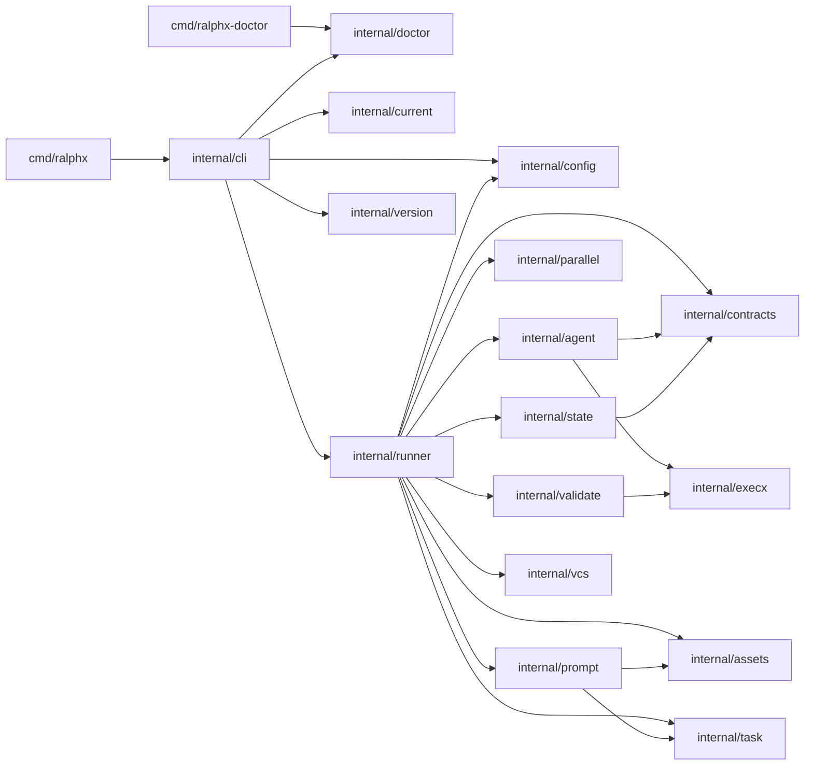
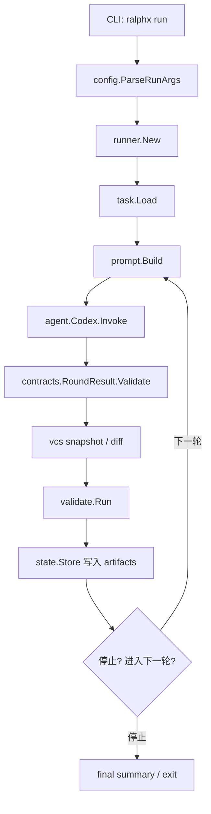
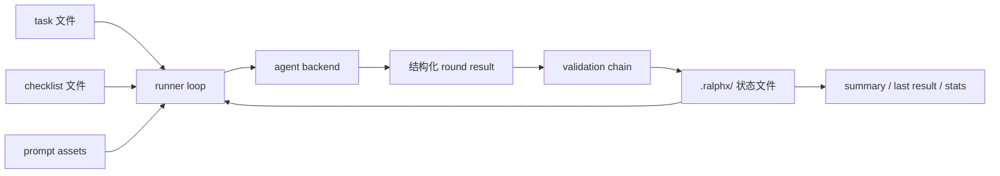
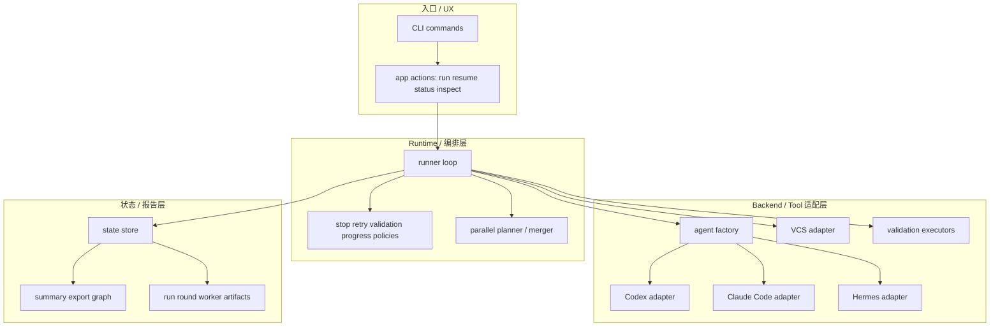
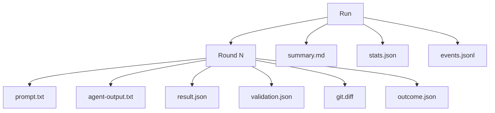
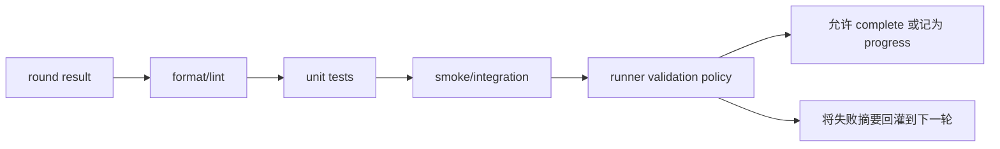
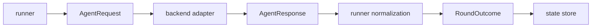
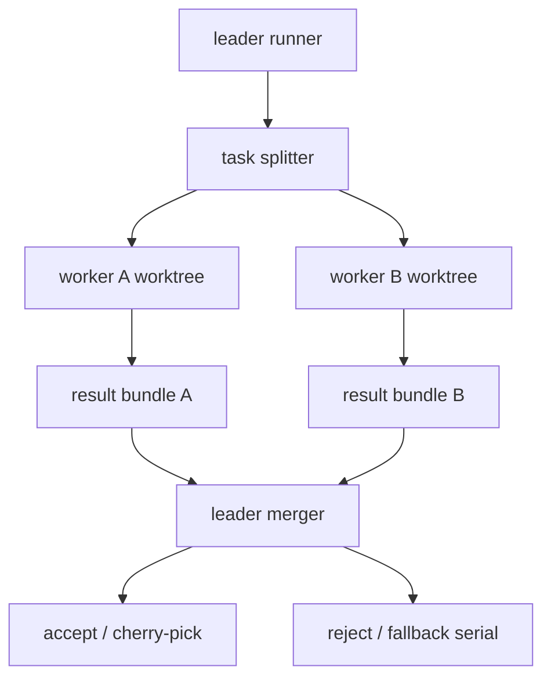

# ralphx 重构图谱总览

本文收集下一阶段 `ralphx` runtime 重构所需的关键图谱与链路图，方便快速分析、讨论和落地。

## 1. 当前模块依赖图

## 2. 当前 runtime 控制链路

## 3. 当前状态与产物流

## 4. 重构后的目标分层

## 5. 建议的 run/round 状态模型

## 6. 计划中的 validation pipeline

## 7. 计划中的 backend 调用契约

## 8. 安全并行执行目标图

## 9. 文档与代码映射建议

| 关注点 | 当前文件 | 后续更合适的位置 |
| --- | --- | --- |
| CLI 分发 | `internal/cli/app.go` | `internal/app/*` + 更薄的 `internal/cli/app.go` |
| Agent backend | `internal/agent/codex.go` | `internal/agent/{factory,codex,claudecode,hermes}.go` |
| Runner loop | `internal/runner/loop.go` | `internal/runner/{loop,policies,stop,progress}.go` |
| Validation | `internal/validate/validate.go` | `internal/validate/{pipeline,steps}.go` |
| State | `internal/state/*` | `internal/state/*` + `internal/report/*` |
| Parallel | `internal/parallel/*` | `internal/parallel/{scheduler,planner,merger}.go` |
| 图谱/导出 | 当前仅 docs | 后续可加 `internal/report/graph.go` |

## 10. 使用方式

- 修改 package 边界前，先看第 1 节。
- 要验证当前行为是否被保留，先看第 2–3 节。
- 做 staged runtime refactor 时，重点参考第 4–8 节。
- 之后只要 package 边界或 artifact 布局有变化，都应同步更新这份图谱。
